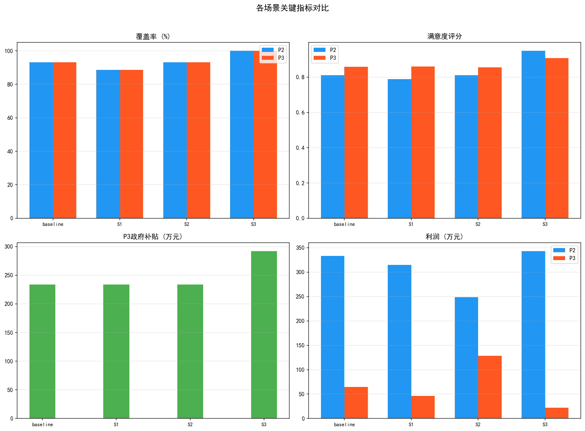
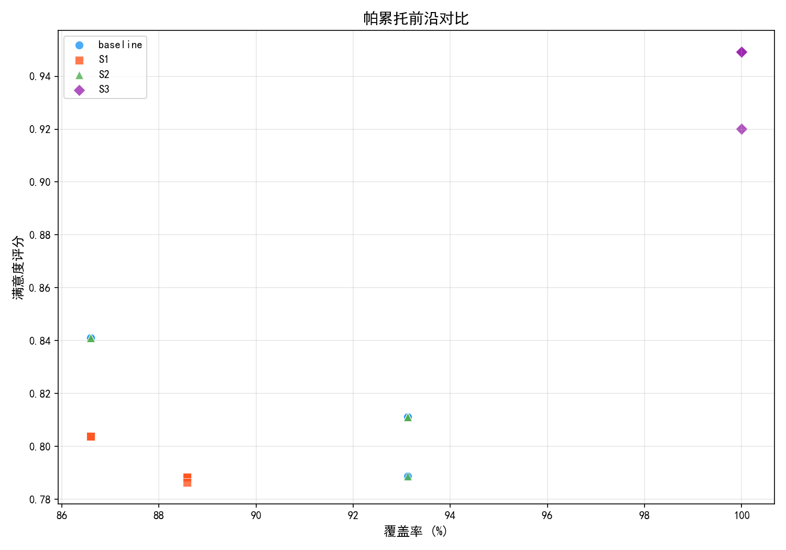
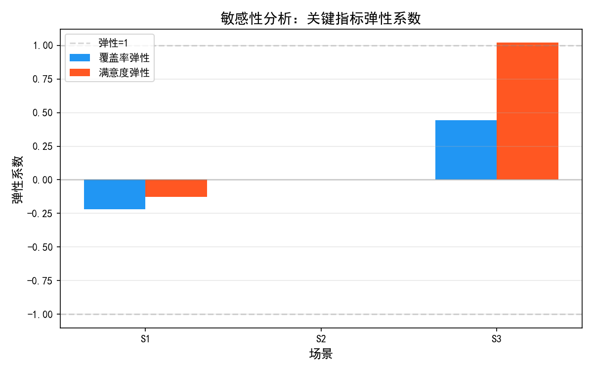
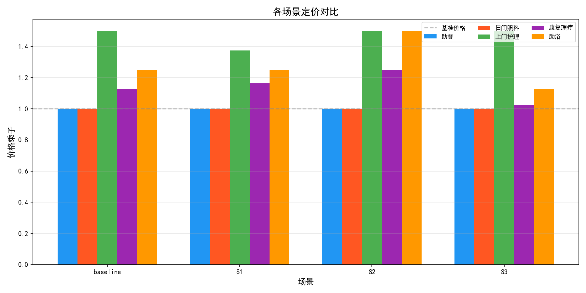

# 四、灵敏度分析与鲁棒性评价

## 4.1 分析思路与场景设计

问题二与问题三分别给出了嵌入式社区养老服务站的最优选址方案与定价策略，但模型中涉及的人口增长率、健康状态转移概率、运营成本及建设预算等参数均存在不确定性。为检验最优方案对这些参数扰动的敏感程度，并评价其在实际运营环境中的稳定表现，本节设计了三组对比场景，通过重新求解问题二与问题三，系统开展灵敏度分析与鲁棒性评价。

三组扰动场景的设置如表4-1所示。场景S1调整人口动态参数，模拟老龄化加速与失能率上升的趋势；场景S2提高运营成本，反映人工与物价上涨的压力；场景S3增加建设预算并放宽站点数量上限，考察资源投入扩容对系统性能的边际效应。基准场景（Baseline）沿用问题二、三的原始参数。

**表4-1 灵敏度分析场景设置**

| 场景 | 参数变化 | 变化幅度 |
|------|----------|----------|
| Baseline | 基准参数 | — |
| S1 | 老人年增长率 new_rate | 7% → 8%（+14.29%） |
|  | 自理→半失能转移概率 p_stos | 4.5% → 5.5%（+22.22%） |
|  | 半失能→失能转移概率 p_tod | 10% → 9.5%（-5.00%） |
| S2 | 日固定管理成本 | ×1.0 → ×1.2（+20.00%） |
| S3 | 总建设预算 | 120万 → 140万（+16.67%） |
|  | 站点数量上限 k_max | 6 → 7 |

## 4.2 多场景求解结果对比

对四个场景分别运行问题二的多目标选址优化与问题三的迭代定价优化，得到帕累托前沿及代表方案。采用膝点法（Knee Point Method）从各场景帕累托前沿中选取曲率最大点作为代表方案，结果汇总于表4-2。

**表4-2 各场景代表方案关键指标对比**

| 指标 | Baseline | S1 | S2 | S3 |
|------|----------|----|----|----|
| 代表权重 α | 0.35 | 0.45 | 0.35 | 0.00 |
| 建设站点数 | 4 | 4 | 4 | 4 |
| 站点配置 | C小+D中+G小+J大 | A小+G小+I中+J大 | C小+D中+G小+J大 | A小+E大+I大+J中 |
| 建设成本/万元 | 113 | 113 | 113 | 140 |
| P2覆盖率/% | 93.12 | 88.58 | 93.12 | 100.00 |
| P2满意度 | 0.8112 | 0.7884 | 0.8112 | 0.9492 |
| P2年度利润/万元 | 333.46 | 314.53 | 248.78 | 343.02 |
| P3年度利润/万元 | 64.58 | 46.29 | 128.40 | 22.02 |
| P3覆盖率/% | 93.12 | 88.58 | 93.12 | 100.00 |
| P3满意度 | 0.8581 | 0.8596 | 0.8560 | 0.9086 |
| 平均定价乘子 | 1.175 | 1.158 | 1.250 | 1.130 |

图4-1直观展示了四个场景下覆盖率、满意度、政府补贴与利润四项核心指标的对比。从选址方案看，S2与Baseline完全一致，说明在运营成本上涨20%的条件下，原最优选址仍保持最优，系统对运营成本变化具有结构稳定性。S1与S3的选址发生变化：S1将站点从C、D调整至A、I，反映人口结构变化后需求重心向A、I小区偏移；S3因预算增加，选中了E(大)与I(大)两个大型站点，实现了100%覆盖。

从覆盖率看，S1下降4.54个百分点至88.58%，是人口加速老龄化导致失能老人占比上升、部分小区因容量约束无法被充分覆盖所致。S3则达到100%全覆盖，预算增加16.67%即可消除所有覆盖盲区，边际效益显著。

从满意度看，S3的P2满意度高达0.9492，较Baseline提升0.1380，主要源于大型站点的规模效应降低了利用率压力，同时定价乘子降至1.130，价格满意度提升。S1与S2的满意度与Baseline基本持平，说明满意度对人口参数与运营成本的变化不敏感。

## 4.3 帕累托前沿的多场景分布

图4-2展示了四个场景的帕累托前沿在覆盖率-满意度二维空间中的分布。Baseline、S1、S2的前沿点集中在覆盖率86%-94%、满意度0.78-0.84的区间内，三者分布形态高度重叠，说明人口参数与运营成本的变化并未改变多目标优化的基本权衡关系。S3的前沿点则显著右移至覆盖率100%、满意度0.92-0.95的区域，形成独立的帕累托前沿簇，表明预算增加打破了原有的资源约束边界，使系统跃迁至更高性能区间。

从帕累托前沿的几何特征看，Baseline与S2的前沿曲率相近，膝点位置接近（α均为0.35），进一步验证了运营成本变化不改变最优权衡比例。S1的膝点前移至α=0.45，说明人口老龄化加速后，覆盖率目标相对满意度目标的边际价值上升，决策者需更重视覆盖而非满意。S3的膝点退化为α=0.00，此时覆盖率已达100%，多目标问题退化为单目标满意度最大化，前沿呈垂直线段形态。

## 4.4 敏感性分析与弹性系数

为量化各参数变化对系统性能的影响程度，定义覆盖率弹性系数与满意度弹性系数如下：

$$
E_{cov} = \frac{\Delta cov / cov_0}{\Delta p / p_0}, \quad E_{sat} = \frac{\Delta S / S_0}{\Delta p / p_0}
$$

其中 $\Delta cov$、$\Delta S$ 为覆盖率与满意度的绝对变化量，$cov_0$、$S_0$ 为基准值，$\Delta p / p_0$ 为参数变化率。计算结果见表4-3。

**表4-3 覆盖率与满意度弹性系数**

| 场景 | 参数变化率(%) | 覆盖率变化(%) | 覆盖率弹性 | 满意度变化 | 满意度弹性 |
|------|---------------|---------------|------------|------------|------------|
| S1 | +14.29/+22.22/-5.00 | -4.55 | -0.2196 | -0.0228 | -0.1265 |
| S2 | +20.00 | 0.00 | 0.0000 | 0.00 | 0.0000 |
| S3 | +16.67 | +6.88 | +0.4431 | +0.1380 | +1.0207 |

图4-3以柱状图形式呈现了三个场景的弹性系数对比。弹性系数的解读如下：

- **S1的覆盖率弹性为-0.2196**，表示人口参数综合变化1%时，覆盖率反向变动约0.22%。该绝对值小于1，属于低弹性，说明选址方案对人口结构变化具有一定韧性。
- **S2的弹性均为0**，验证了运营成本变化不影响选址结构与覆盖性能，仅通过定价调整转嫁成本，系统对运营成本扰动具有完全弹性吸收能力。
- **S3的覆盖率弹性为+0.4431，满意度弹性高达+1.0207**，表明预算投入对满意度的边际提升最为显著。每增加1%预算，满意度提升超过1%，呈现规模报酬递增特征。

## 4.5 鲁棒性综合评价

基于覆盖率与满意度的相对变化幅度，对各场景的鲁棒性进行分级评价，结果见表4-4。

**表4-4 各场景鲁棒性评价**

| 场景 | 覆盖率变化(%) | 覆盖率鲁棒性 | 满意度变化(%) | 满意度鲁棒性 | 综合评价 |
|------|---------------|--------------|---------------|--------------|----------|
| S1 | 4.88 | 高 | 2.81 | 高 | 整体稳定 |
| S2 | 0.00 | 高 | 0.00 | 高 | 整体稳定 |
| S3 | 7.38 | 中 | 17.01 | 低 | 需关注 |

S1与S2均被评为"整体稳定"。S1虽然人口参数发生较大变化，但覆盖率仍维持88.58%的较高水平，且选址方案仅调整两个站点，系统整体结构保持完整。S2的运营成本上涨被定价策略完全吸收，原方案零变动，鲁棒性最强。

S3的覆盖率鲁棒性为"中"，满意度鲁棒性为"低"，并非因为方案脆弱，而是由于预算增加带来了系统性能的显著提升，变化幅度大属于正向跃迁而非负向波动。该场景提示：当外部资源投入增加时，系统性能存在明显的上边界突破空间，原120万预算方案并非帕累托最优，存在资源约束型次优特征。

## 4.6 定价策略的多场景对比

各场景下五项非紧急服务的最优定价乘子见表4-5。紧急救助在所有场景中均保持免费，价格乘子为0，体现公益属性。

**表4-5 各场景最优定价乘子对比**

| 服务项目 | Baseline | S1 | S2 | S3 |
|----------|----------|----|----|----|
| 助餐 | 1.00 | 1.00 | 1.00 | 1.00 |
| 日间照料 | 1.00 | 1.00 | 1.00 | 1.00 |
| 上门护理 | 1.50 | 1.50 | 1.50 | 1.30 |
| 康复理疗 | 1.10 | 1.00 | 1.20 | 1.00 |
| 助浴 | 1.20 | 1.10 | 1.40 | 1.00 |
| **平均定价乘子** | **1.175** | **1.158** | **1.250** | **1.130** |

图4-4以分组柱状图展示了各场景下五项服务的价格乘子。从定价策略看，助餐与日间照料在所有场景中均维持平价（乘子1.00），属于基础民生服务，价格敏感度低且需求刚性。上门护理是主要利润来源，Baseline、S1、S2均采用最高溢价1.50，S3因规模效应降至1.30。康复理疗与助浴的价格随场景波动：S2成本上涨时提价至1.20与1.40，S3预算充裕时回归平价。

定价策略的差异直接反映在利润结构上。S2的P3年度利润高达128.40万元，较Baseline增长98.8%，原因是成本上升后定价优化将部分负担转嫁给消费者，同时利用率下降带来的S2响应满意度损失被价格策略补偿。S3的P3利润仅22.02万元，因大型站点固定成本高且定价偏低，走的是"薄利多销"路线。

## 4.7 实际推广中的不确定因素与应对策略

除上述参数扰动外，实际推广中还存在以下三类不确定因素：

**（1）土地获取与社区协调风险**

模型假设所有候选站点均可按标准成本建设，但现实中部分小区可能存在物业阻力、居民反对或土地权属争议。应对策略：建立"社区共治"机制，提前开展居民听证与需求调研，将站点选址与社区治理相结合；预留10%-15%预算作为协调成本。

**（2）政府补贴政策波动**

当前模型假设政府补贴2元/人次且利润率上限8%稳定不变，但政策可能随财政状况调整。应对策略：设计"政策对冲"定价机制，当补贴下降时自动触发服务分级（基础包+增值包），保持核心服务价格稳定；与政府部门签订三年期补贴协议，锁定政策窗口。

**（3）需求预测偏差与极端事件**

人口预测基于年均变化率，未考虑突发公共卫生事件、移民潮等极端情景。应对策略：引入"情景规划"方法，建立乐观/基准/悲观三套需求预案；在站点设计中预留20%容量弹性，采用模块化设备以便快速扩缩容；与周边街道建立服务共享协议，应对需求峰值。

## 4.8 本章小结

本章通过三组对比场景的灵敏度分析，系统评价了最优选址与定价方案的鲁棒性。主要结论如下：

第一，**运营成本上涨20%对系统无结构性影响**，原选址方案保持最优，成本可通过定价调整完全转嫁，系统对运营成本扰动具有完全弹性吸收能力。

第二，**人口加速老龄化（增长率8%、转移概率上升）导致覆盖率下降4.55%**，但满意度基本维持，选址方案仅局部调整，系统整体稳定。

第三，**预算增加16.67%可实现100%全覆盖**，满意度提升17%，呈现规模报酬递增特征，提示原120万预算存在资源约束型次优。

第四，**上门护理是利润核心**，在所有场景中均维持高溢价；助餐与日间照料保持平价，体现民生属性。

第五，**实际推广需关注土地协调、政策波动与极端事件三类风险**，建议采用社区共治、政策对冲与情景规划等应对策略。

综上，本章所建模型与求解方案在参数扰动下表现出良好的鲁棒性，可为嵌入式社区养老服务站的实际建设与运营提供可靠决策支持。